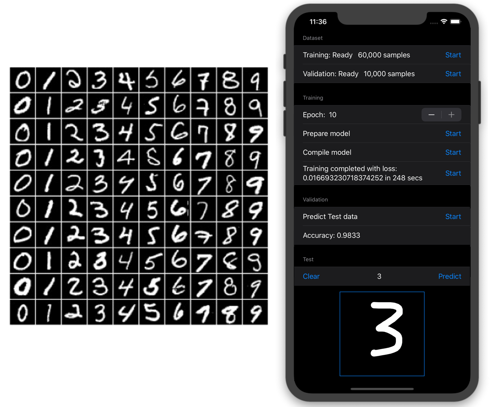

# MNIST-CoreML-Training

CoreML + SwiftUI demo App to demonstrate the potentiality of the **SwiftCoreMLTools** library (https://github.com/JacopoMangiavacchi/SwiftCoreMLTools) to fully create and train on iOS devices a Convolutional Neural Network for the MNIST dataset.



## Models architecture


## Dataset

## SwiftCoreMLTools Trainable Model

```swift
```

## TensorFlow 2.0 baseline model

```python
```

## Performance results

