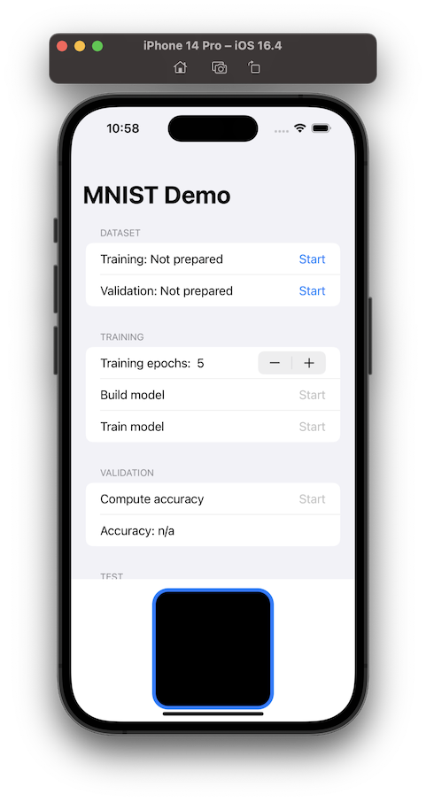

# MNIST-CoreML-Training

CoreML + SwiftUI demo App to demonstrate the potentiality of the **SwiftCoreMLTools** library (https://github.com/JacopoMangiavacchi/SwiftCoreMLTools) to fully create and train on iOS devices a Convolutional Neural Network for the MNIST dataset.



## Dataset

The MNIST dataset (Creator: Yann LeCun, Corinna Cortes) of handwritten digits, available from this page [MNIST dataset](http://yann.lecun.com/exdb/mnist/), has a training set of 60,000 examples, and a test set of 10,000 examples. It is a subset of a larger set available from NIST. The digits have been size-normalized and centered in a fixed-size image. 

It is a good database for people who want to try learning techniques and pattern recognition methods on real-world data while spending minimal efforts on preprocessing and formatting.


## SwiftCoreMLTools Trainable Model

```swift
public func prepareModel() {
    let coremlModel = Model(version: 4,
                            shortDescription: "MNIST-Trainable",
                            author: "Jacopo Mangiavacchi",
                            license: "MIT",
                            userDefined: ["SwiftCoremltoolsVersion" : "0.0.12"]) {
        Input(name: "image", shape: [1, 28, 28])
        Output(name: "output", shape: [10], featureType: .float)
        TrainingInput(name: "image", shape: [1, 28, 28])
        TrainingInput(name: "output_true", shape: [1], featureType: .int)
        NeuralNetwork(losses: [CategoricalCrossEntropy(name: "lossLayer",
                                   input: "output",
                                   target: "output_true")],
                      optimizer: Adam(learningRateDefault: 0.0001,
                                     learningRateMax: 0.3,
                                     miniBatchSizeDefault: 128,
                                     miniBatchSizeRange: [128],
                                     beta1Default: 0.9,
                                     beta1Max: 1.0,
                                     beta2Default: 0.999,
                                     beta2Max: 1.0,
                                     epsDefault: 0.00000001,
                                     epsMax: 0.00000001),
                      epochDefault: UInt(self.epoch),
                      epochSet: [UInt(self.epoch)],
                      shuffle: true) {
            Convolution(name: "conv1",
                         input: ["image"],
                         output: ["outConv1"],
                         outputChannels: 32,
                         kernelChannels: 1,
                         nGroups: 1,
                         kernelSize: [3, 3],
                         stride: [1, 1],
                         dilationFactor: [1, 1],
                         paddingType: .valid(borderAmounts: [EdgeSizes(startEdgeSize: 0, endEdgeSize: 0),
                                                             EdgeSizes(startEdgeSize: 0, endEdgeSize: 0)]),
                         outputShape: [],
                         deconvolution: false,
                         updatable: true)
            ReLu(name: "relu1",
                 input: ["outConv1"],
                 output: ["outRelu1"])
            Pooling(name: "pooling1",
                         input: ["outRelu1"],
                         output: ["outPooling1"],
                         poolingType: .max,
                         kernelSize: [2, 2],
                         stride: [2, 2],
                         paddingType: .valid(borderAmounts: [EdgeSizes(startEdgeSize: 0, endEdgeSize: 0),
                                                             EdgeSizes(startEdgeSize: 0, endEdgeSize: 0)]),
                         avgPoolExcludePadding: true,
                         globalPooling: false)
            Convolution(name: "conv2",
                         input: ["outPooling1"],
                         output: ["outConv2"],
                         outputChannels: 32,
                         kernelChannels: 32,
                         nGroups: 1,
                         kernelSize: [2, 2],
                         stride: [1, 1],
                         dilationFactor: [1, 1],
                         paddingType: .valid(borderAmounts: [EdgeSizes(startEdgeSize: 0, endEdgeSize: 0),
                                                             EdgeSizes(startEdgeSize: 0, endEdgeSize: 0)]),
                         outputShape: [],
                         deconvolution: false,
                         updatable: true)
            ReLu(name: "relu2",
                 input: ["outConv2"],
                 output: ["outRelu2"])
            Pooling(name: "pooling2",
                         input: ["outRelu2"],
                         output: ["outPooling2"],
                         poolingType: .max,
                         kernelSize: [2, 2],
                         stride: [2, 2],
                         paddingType: .valid(borderAmounts: [EdgeSizes(startEdgeSize: 0, endEdgeSize: 0),
                                                             EdgeSizes(startEdgeSize: 0, endEdgeSize: 0)]),
                         avgPoolExcludePadding: true,
                         globalPooling: false)
            Flatten(name: "flatten1",
                         input: ["outPooling2"],
                         output: ["outFlatten1"],
                         mode: .last)
            InnerProduct(name: "hidden1",
                         input: ["outFlatten1"],
                         output: ["outHidden1"],
                         inputChannels: 1152,
                         outputChannels: 500,
                         updatable: true)
            ReLu(name: "relu3",
                 input: ["outHidden1"],
                 output: ["outRelu3"])
            InnerProduct(name: "hidden2",
                         input: ["outRelu3"],
                         output: ["outHidden2"],
                         inputChannels: 500,
                         outputChannels: 10,
                         updatable: true)
            Softmax(name: "softmax",
                    input: ["outHidden2"],
                    output: ["output"])
        }
    }

    let coreMLData = coremlModel.coreMLData
    try! coreMLData!.write(to: coreMLModelUrl)
}
```

## TensorFlow 2.0 baseline model

```python
model = Sequential()
model.add(Conv2D(32, (3, 3), activation='relu', kernel_initializer='he_uniform', input_shape=in_shape))
model.add(MaxPool2D((2, 2), strides=(2,2)))
model.add(Conv2D(32, (2, 2), activation='relu', kernel_initializer='he_uniform', input_shape=in_shape))
model.add(MaxPool2D((2, 2), strides=(2,2)))
model.add(Flatten())
model.add(Dense(500, activation='relu', kernel_initializer='he_uniform'))
model.add(Dense(n_classes, activation='softmax'))

model.summary()
```

```
Model: "sequential"
_________________________________________________________________
Layer (type)                 Output Shape              Param #
=================================================================
conv2d (Conv2D)              (None, 26, 26, 32)        320
 _________________________________________________________________
max_pooling2d (MaxPooling2D) (None, 13, 13, 32)        0
_________________________________________________________________
conv2d_1 (Conv2D)            (None, 12, 12, 32)        4128
_________________________________________________________________
max_pooling2d_1 (MaxPooling2 (None, 6, 6, 32)          0
 _________________________________________________________________
flatten (Flatten)            (None, 1152)              0
_________________________________________________________________
dense (Dense)                (None, 500)               576500
_________________________________________________________________
dense_1 (Dense)              (None, 10)                5010
=================================================================
Total params: 585,958 Trainable params: 585,958 Non-trainable params: 0
```

```python
model.compile(optimizer='adam', loss='sparse_categorical_crossentropy', metrics=['accuracy'])

model.fit(trainX, trainy, epochs=10, batch_size=128, verbose=1)
```

```
Train on 60000 samples
Epoch 1/10
60000/60000 [==============================] - 16s 266us/sample - loss: 0.1441 - accuracy: 0.9563
[...]
Epoch 10/10
60000/60000 [==============================] - 15s 257us/sample - loss: 0.0043 - accuracy: 0.9987
Time: 157.58382892608643 seconds
Wall time: 2min 37s
```
## Performance results

